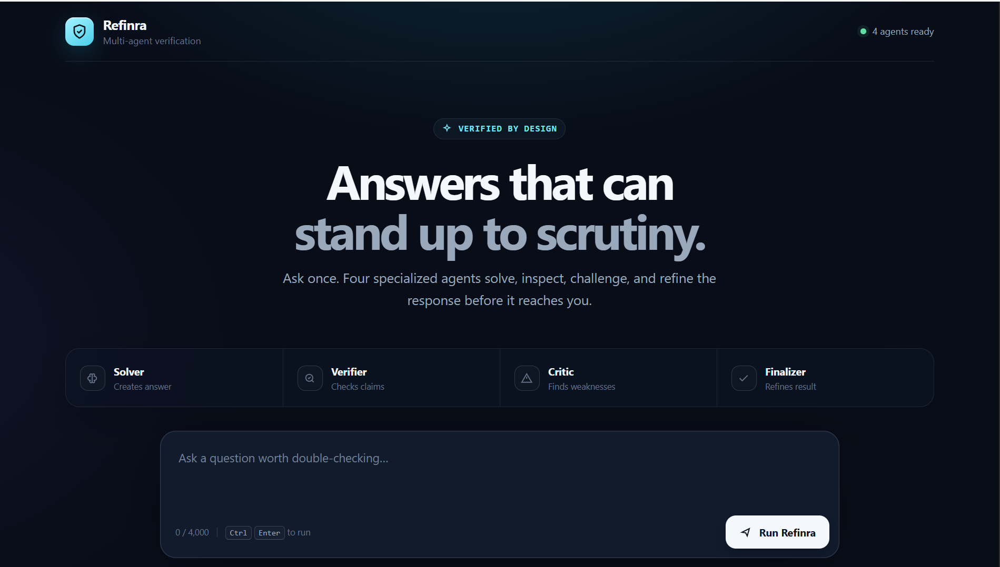

# Refinra

### Multi-Stage AI Verification & Refinement System

Refinra is an experimental AI verification workflow that passes a question through multiple reasoning and review stages before returning a refined response.

Instead of relying on a single AI response, Refinra uses four sequential roles:

**Solver → Verifier → Critic → Finalizer**

The four roles currently use the same configured Gemini model, with separate role-specific prompts and responsibilities. They are sequential stages in one verification pipeline rather than four independently trained models.

---

## How Refinra Works

```text
User Question
      |
      v
   Solver
      |
      v
  Verifier
      |
      v
   Critic
      |
      v
  Finalizer
      |
      v
 Final Answer
```

### Agent Responsibilities

#### 1. Solver

Attempts to solve the user's question and produces an initial answer.

#### 2. Verifier

Checks the Solver's answer for correctness and provides:

- Verdict
- Confidence score
- Explanation

#### 3. Critic

Reviews the Solver and Verifier outputs and looks for:

- Incorrect reasoning
- Missed assumptions
- Verification mistakes
- Inconsistencies

#### 4. Finalizer

Uses the available information from the previous stages to produce the final response.

---

## Architecture

```text
Frontend
   |
   v
FastAPI Backend
   |
   v
Python Pipeline
   |
   +--> Solver
   |
   +--> Verifier
   |
   +--> Critic
   |
   +--> Finalizer
   |
   v
Gemini API
```

---

## Tech Stack

- Python
- FastAPI
- HTML
- CSS
- JavaScript
- Google Gemini API
- `google-genai`
- `python-dotenv`
- Git
- GitHub

---

## Project Structure

```text
Refinra/
│
├── frontend/
│   └── index.html
│
├── api.py
├── pipeline.py
├── gemini_pipeline.py
├── scripts/
│   └── check_gemini.py
├── requirements.txt
├── .gitignore
└── README.md
```

---

## API Endpoints

### `GET /`

Checks that the backend is running.

### `GET /health`

Returns the backend health status.

Example:

```json
{
  "status": "ok"
}
```

### `POST /verify`

Runs the complete four-stage verification pipeline.

Request:

```json
{
  "question": "What is 2 + 2?"
}
```

The request is processed through Solver, Verifier, Critic, and Finalizer in sequence.

---

## Running Locally

### 1. Clone the repository

```bash
git clone https://github.com/shubham2411-cpu/Refinra.git
cd Refinra
```

### 2. Create a virtual environment

```bash
python -m venv venv
```

### 3. Activate the virtual environment

Windows Command Prompt:

```cmd
venv\Scripts\activate.bat
```

Windows PowerShell:

```powershell
venv\Scripts\Activate.ps1
```

macOS/Linux:

```bash
source venv/bin/activate
```

### 4. Install dependencies

```bash
pip install -r requirements.txt
```

### 5. Configure the Gemini API key

Create a local `.env` file:

```env
GEMINI_API_KEY=your_api_key_here
```

Do not commit the `.env` file to GitHub.

### 6. Start the server

```bash
uvicorn api:app --reload
```

### 7. Open Refinra

```text
http://127.0.0.1:8000/app/
```

---

## Error Handling

Refinra includes handling for Gemini API rate-limit errors.

When the Gemini API returns HTTP 429 / `RESOURCE_EXHAUSTED`, the backend returns a structured rate-limit error. Other pipeline failures return a generic verification error rather than exposing internal details.

---

## Testing

Refinra includes a deterministic mock pipeline that exercises the verification workflow without Gemini API calls. It covers:

- Correct answers
- Incorrect calculations
- Incomplete answers
- Incorrect assumptions

These checks validate deterministic pipeline and orchestration behavior. They do **not** prove that Gemini, the verifier, or Refinra is more accurate than a single AI model.

`scripts/check_gemini.py` is a separate, manual Gemini connectivity smoke check. Run it explicitly from the project root only when a configured API key is available:

```bash
python scripts/check_gemini.py
```

It is not part of normal application startup or automated test discovery.

---

## Important Limitations

Refinra is a verification and refinement system, not a guarantee of factual correctness.

The system does not completely eliminate AI hallucinations.

Its purpose is to introduce additional reasoning and checking stages so that potential mistakes can be identified and challenged before producing the final response.

The confidence score generated by the Verifier is a model-generated assessment and should not be interpreted as a calibrated probability of correctness.

---

## Local-Only Scope

The GitHub repository is public, but the application is intentionally designed to run locally.

Public deployment would require rate limiting, abuse prevention, authentication, quota and cost management, monitoring, logging, and other production controls. Those concerns are outside the current project's main objective. Public deployment may be considered in the future.

---

## Current Scope

Refinra currently focuses on:

- Multi-stage answer verification
- Sequential AI reasoning
- Verification and criticism
- API integration
- Backend/frontend communication
- Local development

The current version does **not** include:

- Database storage
- RAG
- Vector databases
- Web browsing
- Authentication
- Docker
- Fine-tuning
- Custom model training
- LangChain/LangGraph

---

## Project Goal

The goal of Refinra is to explore whether a structured multi-stage workflow can help surface weaknesses in AI-generated answers before producing a final response.

---

## Preview

